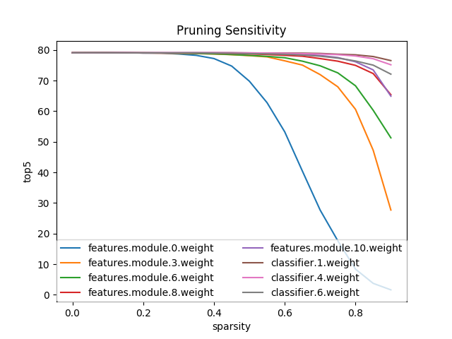

> 读研期间主要做方向就是在显著性预测方向上进行网络轻量化的研究。虽然踩了很多坑，文章也一拖再拖，但神经网络的轻量化/压缩技术确实是一个具有市场潜力与实用价值的方向。在现在边缘计算从AGV到摄像头需求广泛，而算力平台大的如TX2，小的如Movidius能提供的算力还是需要极力去压榨的。  
> 找到一个有意思的git repo：[Neural Network Distiller](https://nervanasystems.github.io/distiller/quantization/)，Intel AI Lab做的专门进行神经网络压缩方向的工作，一千多个star了，文档也很丰富。就干脆按照doc的结构，结合自己的总结重新整理一遍。

### 量化 quantization

TODO

### 知识蒸馏 distillation

> 知识蒸馏的核心在于相信soft label比one-hot label带有更强的分布信息，而大网络相对小网络有更强的泛化能力，可以学习到更贴近真实分布的soft output（大网络不是更容易过拟合嘛）。以大网络的soft output作为label训练小网络，可以将这种泛化作为一种regularization，侧面约束小网络得到更好的泛化性。

类似昆虫的幼虫期与成虫期从生存需求上的区别导致其形态差别巨大，神经网络在训练和部署时形态也应该有区别的。训练时可以是大的，冗余的模型（大的单一模型，或多个模型的ensemble），部署时可通过让一个小模型以训练好的大模型的logit/softmax输出为label，去学习大模型学到的概率分布，即知识蒸馏。

知识蒸馏依赖或做出了以下假设：

* 对大模型是学习其logit/softmanx输出。对ensemble模型是学习多个模型logit/softmax输出的均值。

* 没有one-hot化的softmax输出是带有泛化信息的，因为他是平滑的概率分布。由于softmax是求指数之后的，对两端的值是又压缩的，直接用logits（未softmax的输出）可能更加平滑。但实际上，同时使用soft target和one-hot true label效果更好。

* 阻碍模型压缩的难点之一在于，之前的尝试大多从训练完成后网络的参数视角对模型的学习能力进行理解，而非将模型看作由输入向量到输出向量的映射，来理解其学习能力。

* 在进行分类训练时，正常学习外的一个side effect是，模型除了会给正确的分类一个正确的概率分布外，还会给错误的分类一个错误的概率分布。这种错误分布往往能侧面反映网络实际学到的分布。

* 对于大的分类数据集，可以使用单个大的网络+多个专家网络的ensemble策略。专家网络针对易混淆分类进行训练，由于最后不从网络参数进行迁移而从输出概率分布迁移，所以小的专家网络的结构不受限制。

### 剪枝 pruning

剪枝即将符合剪枝规则的神经元置0，同时其上的梯度将不被回传。剪枝规则一般为设置一个weight的绝对值阈值，小于阈值的即置0。剪枝一般只发生在weight上，因为bias数量少，且对输出的相对贡献较大。
<!-- 剪枝可以发生在weight/bias/activation上，但一般对activation进行剪枝。bias由于其数量少对输出的贡献相对大，而weight通常很小，所以通常不作为剪枝策略。 -->

网络中，不同深度，不同类型的神经元对剪枝的敏感度是不同的。在AlexNet top5 acc实验中，越深的神经元越不敏感，且全连接比卷积不敏感：

l0范数可用于量化网络的sparsity。

### 正则化 regularization

通过正则进行网络压缩的手段是以正则形成稀疏的网络，再利用稀疏网络中大量0值压缩网络结构。Sparse neural networks hold the promise of speed, small size, and energy efficiency. 

### 条件计算 conditional computation

TODO

--- 

### 轻量化网络设计

除了对已有网络进行压缩外，从设计思路上也可以对神经网络的模型尺度进行压缩，其常用的神经网络模块为深度可分离卷积。深度可分析卷积及其几种典型实现：SqueezeNet、MobileNet、ShuffleNet。

TODO